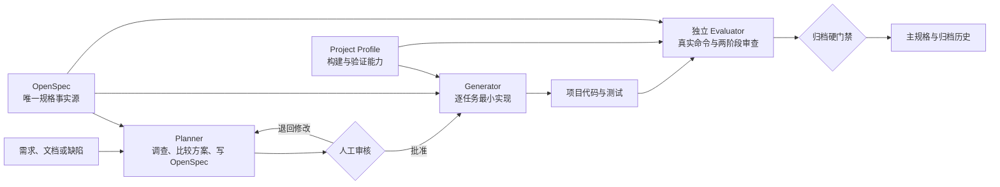
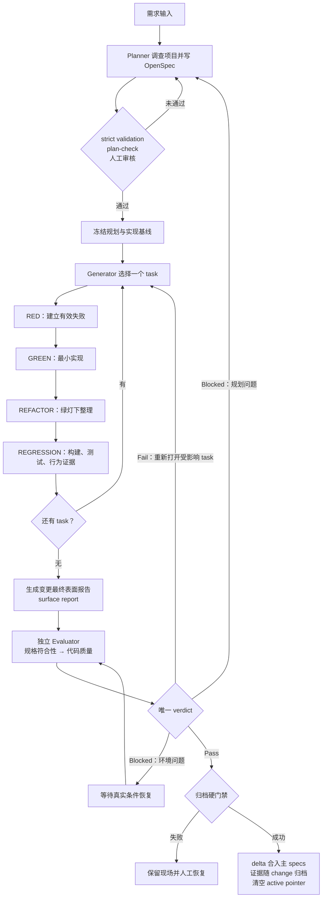
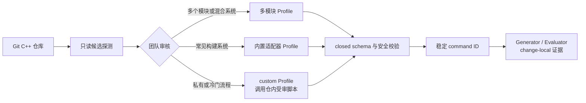
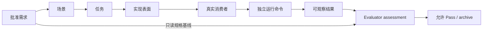

# AutoAI Coding Harness

> 本项目由“cpp辅导的阿甘”开发。

AutoAI Coding Harness 是一套面向通用 C++ 项目的 AI 开发治理工具。它通过一个 Shell 脚本，把 OpenSpec 工作流、项目适配、角色分工、真实命令证据和归档门禁安装到已有 Git 仓库中。

当前版本：`v4.0.0`

固定 OpenSpec 版本：`@fission-ai/openspec@1.6.0`

**要解决的问题：** AI 可以快速写代码，但也容易跳过调查和方案审核、扩大实现范围、制造从未接入产品的接口，并在缺少真实运行证据时宣布完成。

**采用的方案：**

- OpenSpec 管“为什么改、要改成什么、怎样设计、拆成哪些任务”。
- Project Profile 管“这个项目怎样构建、测试、安装、运行和验证”。
- AutoAI Harness 管“由谁执行、怎样留证、什么条件下才能完成和归档”。



Harness 只生成治理规则、Prompt、OpenSpec 制品、状态、证据和辅助脚本。它不会创建 `src/`、`include/`、`tests/` 等业务目录，不会自动修改业务源码，也不会把 Generator、Evaluator 或验证脚本链接进产品。

项目内置 `minimal-implementation` Skill，用于减少功能代码中的重复校验、无实际职责的包装和冗余状态。它贯穿规划、实现收尾和独立代码质量审查，保留必要行为、错误处理及资源管理。

## 快速开始

### 环境要求

目标项目需要满足：

- 由 Git 管理，并从仓库根目录运行初始化。
- Harness 控制面运行在 Linux。
- 默认初始化需要 Node.js `>=20.19.0`、npm 和 npx。
- 首次冷缓存执行 OpenSpec 时，能够访问 npm registry。
- 项目本身能够在 Linux 原生构建，或通过自己的工具链交叉构建。

只读项目探测不需要 Node、npm 或 npx。

### 1. 只读探测项目

进入目标 C++ 仓库根目录，使用 AutoAI-Coding 仓库中的脚本：

```bash
cd /path/to/your-cpp-project
bash /path/to/AutoAI-Coding/setup_ai_harness.sh --detect-project
```

需要机器可读结果时：

```bash
bash /path/to/AutoAI-Coding/setup_ai_harness.sh --detect-project --json
```

探测只读取仓库文件，不执行 configure、build 或 test，不安装依赖，也不修改工作区。输出只是模块和构建方式的候选，不能替代团队审核。

### 2. 初始化 Harness

交互式终端可以确认探测候选并生成 Project Profile：

```bash
bash /path/to/AutoAI-Coding/setup_ai_harness.sh
```

自动化或非交互环境必须传入已经审核的 Profile：

```bash
bash /path/to/AutoAI-Coding/setup_ai_harness.sh \
  --project-profile path/to/project-profile.json
```

Profile 结构可参考
[测试用最小样例](tests/openspec-integration/fixtures/default/project-profile.json)，
但其中的模块、路径和命令只是 fixture，不能未经审核直接用于真实项目。

如果目标仓库已经存在有效的 `.ai-harness/project-profile.json`，可以省略 `--project-profile`。

fresh 项目只初始化一次 OpenSpec：

```text
init . --tools none --profile core
```

已有兼容的 `spec-driven` OpenSpec 项目只做兼容检查并补充 AutoAI 模板，不会重复初始化，也不会覆盖已有 specs、change 或 evidence。

初始化同时生成项目内的 `minimal-implementation` Skill，无需单独安装。两个入口由同一模板生成，内容一致：

- `.agents/skills/minimal-implementation/SKILL.md`：AGENTS 和三个角色 Prompt 的读取入口。
- `.claude/skills/minimal-implementation/SKILL.md`：CLAUDE 的读取入口。

更新已有项目时，从目标 Git 仓库根目录运行：

```bash
bash /path/to/AutoAI-Coding/setup_ai_harness.sh --force
```

该流程先备份再更新受管模板。未受管同名文件存在冲突时会报告问题，由用户核对处理；安装只作用于目标项目，不检查全局 Skill 或下载网络版 Skill。

### 3. 检查项目就绪状态

```bash
./scripts/project_profile.sh --check
./scripts/harness_doctor.sh --strict
```

Doctor 检查 Profile、工具和 Harness 控制面是否可用。Doctor 通过不等于产品功能已经通过测试或验收。

### 4. 创建第一个 change

```bash
./scripts/change_new.sh add-health-check
./scripts/change_status.sh
```

然后让 Planner 读取：

```text
AGENTS.md
prompts/planner.md
openspec/specs/
openspec/changes/add-health-check/
.ai-harness/project-profile.json
```

Planner 完成方案并通过机器检查后停下，由你审核。审核通过后再让 Generator 编码。

规划完成后先运行：

```bash
./scripts/openspec_cli.sh validate add-health-check \
  --type change --strict --json --no-interactive
./scripts/integration_surface_check.sh add-health-check --plan-check --json
```

你明确批准方案后，冻结规划和实现基线：

```bash
./scripts/snapshot_update.sh \
  --freeze-planning-baseline \
  --phase plan_ready \
  --current-step planning-approved \
  --next-step freeze-implementation-base

./scripts/snapshot_update.sh \
  --freeze-implementation-base \
  --phase implementing \
  --current-step implementation-base-frozen \
  --next-step implement-first-task
```

第二条命令把当前 Git 提交作为实现起点。工作树中已有、确实属于本次 change
的未提交业务路径，必须由用户逐项确认后用 `--adopt-path <path>` 接管，不能由
Agent 猜测归属。

## 三种开发路径

Harness 不要求所有工作都走同一种粒度。先根据问题类型选择路径，再进入统一的独立验收和归档门禁。

### 路径 A：单个功能或已知根因修复

适用于一个可以独立说明、实现和验收的功能、小型重构，或根因已经确认的缺陷。

```text
需求
  → 创建 OpenSpec change
  → Planner 调查并形成方案
  → 人工审核
  → Generator 按 task 实现
  → Evaluator 独立验收
  → archive
```

常用入口：

```bash
./scripts/change_new.sh <change-name>
./scripts/change_status.sh
```

### 路径 B：未知根因问题

适用于崩溃、性能回退、偶发错误、环境相关问题，或任何尚不能证明根因的缺陷。

```text
异常现象
  → 创建或选择诊断 change
  → 建立稳定复现
  → 收集证据
  → 提出一个可证伪假设
  → 做最小实验
  → 根因成立
  → Planner 完成修复规格与任务
  → 路径 A
```

RCA 是诊断证据，不是第二套规格工作流：

```bash
./scripts/rca_new.sh [<change>]
```

连续三次经过验证的直接修复仍失败时，Generator 必须停止叠加补丁，返回 Planner 重新检查假设、范围和架构。

### 路径 C：大型或多模块目标

适用于需要多个可独立验收 change 的大型项目、跨模块改造或分阶段迁移。

```text
大型目标
  → Planner 拆成多个 OpenSpec change
  → 团队编写 Campaign DAG
  → 查询 next-ready
  → 每个 change 分别走路径 A
  → 所有依赖闭合
```

Campaign 只引用已有 OpenSpec change ID，提供依赖检查和下一候选建议：

```bash
./scripts/campaign.sh <campaign-id> --check
./scripts/campaign.sh <campaign-id> --status
./scripts/campaign.sh <campaign-id> --next-ready
```

它不会创建、选择、实现或归档 change，也不会产生第二份 verdict。

### 怎样选择

| 当前情况 | 推荐路径 |
|---|---|
| 一个可独立验收的功能、小组件或小型重构 | 路径 A |
| 根因已经通过证据确认的缺陷 | 路径 A |
| 根因未知的崩溃、回归或性能异常 | 路径 B |
| 跨模块、跨阶段，需要多个独立 change | 路径 C |
| 当前工作树已有 active change | 先恢复并继续该 change |

## 统一开发生命周期

无论从哪条路径进入，单个 change 都遵循同一条主生命周期。



### 阶段与门禁

| 阶段 | 负责人 | 主要制品 | 进入下一阶段的条件 |
|---|---|---|---|
| 调查与规划 | Planner | `proposal.md`、delta specs、`design.md`、`tasks.md` | OpenSpec strict、完整性 plan-check、方案自审和人工批准 |
| 实现 | Generator | 业务代码、长期测试、task verification、实现规模清单（footprint） | 每个 task 的 TDD/替代验证证据闭合，任务全部完成 |
| 变更最终检查 | Generator 触发，脚本派生 | 产品表面报告（surface report） | 报告已生成且新鲜，任务 obligation 闭合，所有待审候选完整保留 |
| 独立验收 | Evaluator | baseline、command ledger、evaluation | 真实命令、两阶段审查和唯一 `Pass / Fail / Blocked` |
| 归档 | 归档包装器 | 主 specs、archive receipt、归档 change | 所有门禁新鲜且当前 verdict 为 `Pass` |

### 三个角色

| 角色 | 入口 | 可以做什么 | 不能做什么 |
|---|---|---|---|
| Planner | `prompts/planner.md` | 调查项目、比较方案、定义规格、任务、预算、TDD 策略和产品表面 | 未经审核直接修改业务代码 |
| Generator | `prompts/generator.md` | 按 task 实现、测试、记录证据、处理实现级 RCA | 扩大范围、提高预算、批准例外、写最终 Pass 或归档 |
| Evaluator | `prompts/evaluator.md` | 独立运行命令、审规格符合性和代码质量、给出唯一 verdict | 信任 Generator 摘要、修改实现掩盖问题、跳过门禁 |

Superpowers 的 brainstorming、TDD、系统化调试、接收审查意见和 Fresh Context 方法已经融入这些角色规范；Harness 不安装 Superpowers 插件，不生成第二套 plans/specs，也不增加第四个最终裁决者。

同一工作树在同一时刻只允许一个写入者。只读调查和独立审查可以并行；多个写入者只有在用户显式创建独立 worktree、明确 change 身份和集成责任后才允许。

### 辅助入口

| 入口 | 用途 | 边界 |
|---|---|---|
| `prompts/rca.md`、`scripts/rca_new.sh` | 系统化诊断和 change-local RCA | 不替代 Planner 或 OpenSpec |
| `prompts/resume.md`、`scripts/resume_from_snapshot.sh` | 跨会话恢复 active change | 不依赖聊天历史，不创建第二 active selector |
| `prompts/handoff.md` | 把当前事实、证据和下一步交给后续 Agent | 摘要不能替代原始制品 |
| `prompts/full-code-review.md` | 项目完成后做全仓规格与代码审查 | 不自动修改代码或写最终 verdict |
| `debt-register.md`、`scripts/ai_debt_scan.sh` | 记录技术债并做启发式扫描 | 扫描结果需人工核实 |
| `scripts/quick_brief_check.sh` | 检查较长治理文档是否有快速摘要 | 不扫描 OpenSpec 标准 artifacts 和 archive |

## 使用示例

### 示例 1：根据项目文档开发一个功能

你可以这样对 Planner 说：

```text
请阅读 AGENTS.md、prompts/planner.md、当前主 specs、Project Profile 和这份需求文档。
先调查已有实现、调用方和测试，为“新增健康检查命令”创建 OpenSpec change。
比较必要的实现方案，写清非目标、兼容影响、TDD 策略、实现规模预算、
真实消费者和可观察结果。通过 strict 和 plan-check 后停下来供我审核，
不要修改业务代码。
```

审核规划后，再对 Generator 说：

```text
请阅读 AGENTS.md、prompts/generator.md 和 active change 的全部规划制品。
严格按 tasks.md 实现；每次只完成当前 task 的最小闭包，
执行 RED→GREEN→REFACTOR→REGRESSION，并通过受管脚本保存证据。
发现未规划接口、范围或契约变化时返回 Planner，不要自行扩大实现。
```

最后在独立会话中验收：

```text
请阅读 AGENTS.md、prompts/evaluator.md 和 active change。
独立运行真实构建、测试和行为命令，先审规格符合性，再审代码质量；
核对真实消费者、未跟踪文件、产品表面和实现规模，给出唯一 verdict。
```

### 示例 2：排查未知原因崩溃

```text
请先按 prompts/rca.md 做系统化诊断，不要直接修改代码。
建立稳定复现，收集日志和调用路径，每次只验证一个假设。
根因被证据确认后，再让 Planner 创建 bugfix change。
```

如果缺少目标设备、权限或外部服务，结果应是 `Blocked`，不能用 residual risk 把未执行的必要验证改写成 `Pass`。

### 示例 3：大型多模块改造

```text
请先把目标拆成多个可独立验收、可独立归档的 OpenSpec change，
明确依赖关系、兼容顺序和每个 change 的退出条件。
用户审核拆分后再建立 Campaign；Campaign 只给 next-ready 建议，
每个节点仍走完整 Planner、Generator、Evaluator 和 archive 生命周期。
```

### 示例 4：继续中断的工作

```bash
./scripts/resume_from_snapshot.sh
./scripts/change_status.sh
```

恢复脚本从根 `ai_snapshot.json`、active change 和 change-local evidence 重建必读上下文，不依赖上一段聊天记录。

## 命令参考

### 初始化、探测和迁移

```text
bash setup_ai_harness.sh --detect-project [--json]
bash setup_ai_harness.sh [--force] [--project-profile <path>]
bash setup_ai_harness.sh --migrate-openspec [--dry-run] [--project-profile <path>]
bash setup_ai_harness.sh --version
bash setup_ai_harness.sh --help
```

参数边界：

- `--json` 只与 `--detect-project` 组合。
- `--dry-run` 只与 `--migrate-openspec` 组合。
- `--force` 不能与迁移组合。
- `--detect-project` 不能与写入、迁移或 Profile 参数组合。
- `--force` 只备份并更新 AutoAI 管理的模板，不覆盖团队或 OpenSpec 制品。
- v4 已删除 `--no-openspec`；新项目只有统一 OpenSpec 工作流。

setup 使用稳定退出码：

| 退出码 | 含义 |
|---:|---|
| `0` | 成功 |
| `2` | 参数错误 |
| `3` | 必需依赖不可用 |
| `4` | 模式、所有权或 schema 冲突 |
| `5` | legacy 迁移失败 |
| `6` | OpenSpec、JSON 或 strict validation 失败 |

### 项目适配

| 目的 | 命令 |
|---|---|
| 重新只读探测候选 | `./scripts/project_detect.sh [--json]` |
| 校验 Profile | `./scripts/project_profile.sh --check [--json]` |
| 输出 Profile 规范摘要 | `./scripts/project_profile.sh --digest` |
| 执行已审核命令 | `./scripts/project_command.sh <command-id> [--change <id>] [--json]` |
| 检查 Harness 和项目工具 | `./scripts/harness_doctor.sh [--json] [--strict]` |

`project_command.sh` 按 Profile 中的 argv 数组直接启动命令，不经过 `sh -c`。
它返回的成功执行结果封装（envelope）仍需绑定到具体 requirement、task、
surface 和可观察结果，不能单独充当最终验收。

### change 生命周期

| 目的 | 命令 |
|---|---|
| 创建 change；无 active 时自动激活 | `./scripts/change_new.sh <kebab-name>` |
| 创建并显式切换 | `./scripts/change_new.sh <kebab-name> --switch` |
| 接管已有 change | `./scripts/change_adopt.sh <kebab-name> [--switch]` |
| 选择 change | `./scripts/change_select.sh <kebab-name>` |
| 清空选择 | `./scripts/change_select.sh --clear` |
| 查看状态 | `./scripts/change_status.sh [<kebab-name>] [--json]` |
| 从快照恢复 | `./scripts/resume_from_snapshot.sh` |

仓库可以同时存在多个未归档 change，但每个工作树只有根 `ai_snapshot.json` 中的一个 active change。change-local snapshot 不保存第二份 active selector。

### 规划基线、实现和证据

| 目的 | 命令 |
|---|---|
| 检查完整性规划 | `./scripts/integration_surface_check.sh [<change>] --plan-check [--json]` |
| 冻结规划基线 | `./scripts/snapshot_update.sh --freeze-planning-baseline` |
| 冻结实现基线 | `./scripts/snapshot_update.sh --freeze-implementation-base` |
| 重规划后刷新规划基线 | `./scripts/snapshot_update.sh --refresh-planning-baseline` |
| 记录 task 阶段命令 | `./scripts/task_verify.sh <task-id> --phase <phase> [options] {--project-command <id> \| -- <argv...>}` |
| 完成 task | `./scripts/task_verify.sh --complete <task-id>` |
| 计算实现 footprint | `./scripts/change_footprint.sh [<change>] [--json]` |
| 生成最终 surface report | `./scripts/integration_surface_check.sh [<change>] --refresh [--json]` |
| 只读重验 surface report | `./scripts/integration_surface_check.sh [<change>] --check [--json]` |

受审项目命令的正常入口是 `--project-command <command-id>`。例如 Profile 中
已经定义 `test-health`：

```bash
./scripts/task_verify.sh 1.2 --phase red --cycle health-status \
  --kind test --expect-exit 1 \
  --test-path tests/health/health_test.cpp \
  --failure-class assertion \
  --expected-failure "健康状态尚未实现" \
  --match-output "expected healthy" \
  --observed "聚焦断言命中尚未实现的健康状态行为" \
  --project-command test-health

./scripts/task_verify.sh 1.2 --phase green --cycle health-status \
  --kind test --path src/health_service.cpp \
  --project-command test-health

./scripts/task_verify.sh 1.2 --phase regression --cycle health-status \
  --kind test --surface surface-health-status \
  --path src/health_service.cpp \
  --project-command test-health

./scripts/task_verify.sh --complete 1.2
```

注意：`--project-command` 与 `-- <argv...>` 互斥。原始 argv 只用于规划中批准、
长期保留且参与源码指纹的仓内 driver；不能绕过 Profile 临时拼接构建命令。

### 独立验收和归档

```bash
./scripts/evaluator_check.sh --begin <change>

./scripts/evaluator_check.sh --run \
  --kind <build|test|behavior|static> \
  --surface <surface-id> \
  --expect-exit 0 \
  --expected "<预期观察>" \
  --observed "<实际观察>" \
  --project-command <command-id>
```

所有独立命令执行完后，Evaluator 必须按 `prompts/evaluator.md` 和
`docs/ai/evaluation.md` 创建当前 change 的 `harness/evaluation.json`：
把 `evaluation-command-ledger.json` 中由机器采集的 command objects 原样纳入
closed schema，逐项连接 criterion、requirement、scenario、task、surface 和
两阶段 findings，再写入唯一 `Pass / Fail / Blocked`。`--begin` 和 `--run`
不会替 Evaluator 生成 verdict。

最后才校验、封存并尝试归档：

```bash
./scripts/evaluator_check.sh --finish <change>
./scripts/change_archive.sh <change>
```

`--finish` 只检查 `evaluation.json`、ledger、fingerprint 和审查闭包并封存当前
attempt；它不会自动创建报告，也不意味着 verdict 必然是 `Pass`。

`--surface <id>` 是 `<id>=current` 的简写。兼容性验证使用可重复的
`--surface-role <id>=old_consumer|replacement_consumer|absence_probe`；同一个
surface/role 不能同时用两种写法重复绑定。

Evaluator 同样优先使用 `--project-command <command-id>`；只有已批准的仓内
driver 才使用与之互斥的 `-- <argv...>`。

无法继续当前 Evaluation 时：

```bash
./scripts/evaluator_check.sh --abort <change> --reason "<单行脱敏原因>"
```

归档部分失败时：

```bash
./scripts/archive_recover.sh --status
./scripts/archive_recover.sh --acknowledge <change> \
  --reason "<已人工核对的单行脱敏说明>"
```

`archive_recover.sh` 不移动目录、不修改 specs，也不自动重试 archive。它只在人工确认唯一安全状态后解除恢复门禁。

### 索引、上下文和团队协调

| 目的 | 命令 | 权威性 |
|---|---|---|
| 重建或检查项目索引 | `./scripts/project_index.sh --refresh\|--check [--json]` | 本机派生，可重建 |
| 生成任务上下文切片 | `./scripts/context_slice.sh <change> [--task <id>] [--token-budget <n>] --refresh\|--check [--json]` | 阅读建议，不是 specs |
| 检查 Campaign | `./scripts/campaign.sh <campaign-id> --check\|--status\|--next-ready [--json]` | 只读调度建议 |
| 重建事件审计视图 | `./scripts/event_audit.sh <change> --refresh\|--check [--json]` | 派生视图，不是状态源 |
| 校验组织策略 | `./scripts/organization_policy.sh --check [--json]` | 团队控制策略 |
| 检查工作流契约 | `./scripts/workflow_contract_check.sh [--json]` | 控制面一致性 |
| 检查项目署名 | `./scripts/attribution_check.sh` | 仓库规则完整性 |

项目索引由 Profile、Git 可见源码、适配器导出的 build graph 和保守探测派生；
上下文切片再根据当前 change、产品表面和一跳依赖关系安排阅读顺序。它们用于在
token 预算内减少无关上下文，不证明需求已经实现。源码、Profile 或工具链身份
变化后，旧索引和切片会变为 stale；Evaluator 仍必须读取完整 review input 和
真实命令证据。

## Project Profile 与通用 C++ 适配

### Profile 负责什么

`.ai-harness/project-profile.json` 是团队所有的封闭字段（closed）JSON
能力配置。它只回答“项目怎样构建和验证”，不保存需求、阶段、task、active
change 或 verdict。

| 配置区域 | 说明 |
|---|---|
| 模块 | 仓库相对根目录、适配器、C++ 标准、编译器和目标平台 |
| 路径角色 | production、test、example、generated、vendor 和 build metadata |
| 能力 | configure、build、test、install、package、consumer、static-analysis、target-run |
| 命令 | 稳定 command ID、argv、cwd、timeout、环境白名单、`required_tools` 和适用模块 |
| Build graph | target、依赖、测试、consumer 和发布表面的已审核关系 |
| 工具链身份 | 编译器、sysroot、runner 等可复核身份 |

Profile 的 `capability_status` 允许：

- `available`：有审核后的可执行命令。
- `unavailable`：当前环境不可用。
- `not-applicable`：该模块不需要此能力。
- `needs-approval`：候选存在，但尚未获团队批准。

Profile 没有记录的能力由 Doctor 显示为 `absent`；`absent` 不是可以写入 `capability_status` 的值。

缺少某项工具只阻塞依赖该能力的 change，不阻止 Harness 初始化。需要该能力时，不允许用 grep、仅编译成功或不相关命令伪造覆盖。

### 项目差异怎样进入工作流



内置只读探测覆盖以下候选：

- CMake 和 CTest。
- Make 和 Autotools。
- Meson。
- Bazel。
- xmake。
- qmake。
- Ninja。
- 仓库自有脚本和 CI 命令线索。

“被探测到”不代表所有项目形态都已经认证。多个构建系统同时存在时，Harness 保留多个候选，不擅自选择。私有、冷门或混合构建系统通过 `custom` Profile 接入；复杂流程应放在仓内已审核、参与源码指纹的脚本中。

### 常见工程形态

| 工程形态 | 建议建模方式 |
|---|---|
| CMake/CTest、Meson、Bazel、Make、xmake、qmake、Ninja | 内置候选探测后形成审核 Profile |
| 私有或混合构建系统 | `custom` 适配器和仓内受审脚本 |
| Header-only 或 SDK | 代表性 downstream consumer |
| 共享库或安装包 | install/export 后再编译、链接和运行 consumer |
| CLI | 从真实可执行入口验证参数、输出、退出码和状态变化 |
| 插件或回调 | 同时验证注册路径和实际 dispatch |
| 嵌入式或交叉编译 | 分开描述 host build 与 target-run |
| 多模块仓库 | 每个模块独立声明 root、能力和命令 |

## OpenSpec、状态与证据

### 唯一事实源

| 问题 | 唯一位置 |
|---|---|
| 当前已经生效的产品行为是什么 | `openspec/specs/` |
| 某次在途变化要做什么 | `openspec/changes/<change>/` |
| 当前工作树正在处理哪个 change | 根 `ai_snapshot.json` |
| 项目怎样构建和验证 | `.ai-harness/project-profile.json` |
| Generator、Evaluator 和 RCA 的证据在哪里 | change-local `harness/` |
| 历史规格和证据在哪里 | `openspec/changes/archive/` |
| 哪些模板由 AutoAI 管理 | `.ai-harness/manifest.json` |

Project Profile、Campaign、project index、context slice、surface report 和 event audit 都不能成为第二套 specs、active selector 或 verdict。

### 目标项目中的主要目录

```text
.
├── PROJECT_ATTRIBUTION.md
├── AGENTS.md
├── CLAUDE.md
├── .agents/skills/minimal-implementation/SKILL.md
├── .claude/skills/minimal-implementation/SKILL.md
├── ai_snapshot.json
├── .ai-harness/
│   ├── project-profile.json
│   ├── workflow-contract.json
│   ├── manifest.json
│   ├── campaigns/                    # 团队可选
│   ├── organization-policy.json      # 团队可选
│   ├── ci-profiles/                  # 团队可选
│   └── derived/                      # 本机可重建
├── openspec/
│   ├── config.yaml
│   ├── specs/
│   └── changes/
│       ├── archive/
│       └── <change>/
│           ├── proposal.md
│           ├── design.md
│           ├── tasks.md
│           ├── specs/
│           └── harness/
├── docs/ai/
├── prompts/
│   ├── planner.md
│   ├── generator.md
│   ├── evaluator.md
│   ├── archive.md
│   ├── resume.md
│   └── handoff.md
└── scripts/
    ├── project_detect.sh
    ├── project_profile.sh
    ├── project_command.sh
    ├── harness_doctor.sh
    ├── change_new.sh
    ├── change_adopt.sh
    ├── change_select.sh
    ├── change_status.sh
    ├── snapshot_update.sh
    ├── task_verify.sh
    ├── integration_surface_check.sh
    ├── evaluator_check.sh
    ├── change_archive.sh
    └── archive_recover.sh
```

具体生成文件会随 Harness 模板版本演进。标为可选或派生的目录不一定在 setup 后立即存在。

v4 不再生成以下 legacy 入口：

```text
spec.md
todo.md
evaluation.md
verification.md
tasks/
scripts/task_new.sh
prompts/task.md
```

### 文件所有权

| 所有权 | 典型制品 | 普通重跑 | `--force` |
|---|---|---|---|
| AutoAI 管理模板 | `AGENTS.md`、`CLAUDE.md`、`docs/ai/`、`prompts/`、受管脚本 | 已存在则保留 | 备份后更新 |
| 运行状态和 evidence | snapshot、verification、evaluation、RCA | 专用脚本原子更新 | 永不清空 |
| 团队适配制品 | Profile、Campaign、组织策略、CI Profile | 校验并保留 | 永不覆盖 |
| OpenSpec/团队制品 | config、主 specs、proposal、design、delta specs、tasks | 保留 | 永不覆盖 |
| 派生数据 | project index、context slice、event audit | 可检查或重建 | 不作为模板覆盖 |

Harness 不会把治理文件自动加入 C++ target、安装包或产品运行时。如果项目使用全仓 glob、递归安装或宽泛打包规则，Evaluator 必须检查这些文件是否被误收。

### 临时验证程序的受管清理

一次性 probe、下游 consumer 源码、临时工程、二进制和输出只能进入：

```text
.ai-harness/logs/verification-workspaces/<change>/
```

受管命令正常结束、失败或收到可捕获中断后会清理该工作区；task 完成、最终
surface report、Evaluation 和 archive 还会检查它为空。长期 evidence 不保留
临时程序文件；它会保存命令元数据、退出码、输出摘要和指纹。通过
`--project-command` 运行时，还会在
`harness/project-command-evidence/<digest>.json` 保存完整执行结果封装，其中
包含经过限长和模式化脱敏的 stdout/stderr，并随 change 归档。该脱敏不是秘密
扫描器，项目命令本身仍不得输出凭据。

`SIGKILL` 或脱离 wrapper 生命周期的后台写入者仍可能留下残余。后续 task、
report、Evaluation 和 archive 会先清理或拒绝这些残余；这是一套仓库协议，
不是操作系统级“绝不残留”保证。

有长期回归价值的业务测试不属于临时程序，不会被自动删除。Harness 也不会清理项目自己的 build、test 或 example 目录。

## 开发纪律与质量门禁

### TDD：RED → GREEN → REFACTOR → REGRESSION

功能、缺陷修复和行为重构默认执行：

1. **RED**：先建立因为批准行为尚未实现而失败的测试或复现。
2. **GREEN**：只增加让该测试通过的最小实现。
3. **REFACTOR**：保持测试通过的前提下整理重复和命名。
4. **REGRESSION**：运行相关构建、测试和代表性行为。

RED 只能记录为预期失败或无效 RED，永远不能伪装成 `Pass`。编译环境损坏、fixture 错误和无关失败不构成有效 RED。

只有下列六类情况可以由 Planner 申请显式例外：

- `generated_output`：由确定性生成器产生、不能直接采用普通 RED 的输出。
- `documentation_only`：只修改文档，不改变产品行为。
- `configuration_only`：只修改 inert config/metadata；配置解析、默认值、开关和路由变化仍是行为变更，不能使用此例外。
- `disposable_prototype`：一次性探索原型；它永远不能完成 production task。
- `unavailable_hardware`：当前缺少必须的目标硬件。
- `unavailable_external_service`：当前缺少必须的外部服务。

每个例外都必须记录 task、路径、理由、替代 Verify kinds、退出条件和人工批准。
硬件或外部服务例外即使有替代证据，也必须保留为 `blocking_untested`；真实条件
恢复并完成 REGRESSION 前，Evaluation 不能 Pass。

### Implementation Economy：控制代码膨胀

Harness 不给所有项目套一个固定行数上限。小组件和大型系统使用同一原则、不同预算：

- 编码前搜索并复用已有实现。
- 每个 task 只完成一个最小行为闭包。
- Planner 按 change 风险和规模给出自适应预算。
- `change_footprint.sh` 直接记录新增行、改动文件和新增生产文件，并给出公共契约路径、构建目标、build graph、发布表面和依赖变化候选。
- 逐符号公开类型由完整 diff 审查和可选 Clang AST 增强发现，不能仅凭 footprint 宣称完整。
- 新模块、公共表面、依赖或明显超预算必须返回 Planner 审核。
- “以后可能会用”不是新增抽象、接口或框架的理由。

预算是规划和审查阈值，不是代码质量评分，也不是跨项目统一的硬 LOC 限制。合法的大型 change 可以在审核后提高预算；Generator 不能自行提高。

### minimal-implementation：最小必要实现

Skill 用于判断当前实现是否有不必要的复杂度：重复校验、无实际职责的包装、可推导的重复状态，以及没有当前用途的抽象、配置和兼容分支。优先复用已有实现，同时保留必要的输入验证、错误处理、资源管理和仍有真实消费者的兼容行为。

Planner 调查复用机会及新增结构的必要性；Generator 在实现收尾时完成有依据的删除审查；Evaluator 在现有 `code_quality` 阶段独立复核。详细规则保留在生成的 `SKILL.md` 中。

审查复用现有 findings 和唯一 Evaluation verdict。重要问题未解决时阻止 Pass，纯风格偏好不构成硬阻断；不以行数或删除比例判断冗余，没有冗余的改动无需强制重构。Implementation Economy 管理改动预算，Skill 帮助判断具体实现是否必要。

初始化检查完整工作流契约；恢复会话、规划冻结、任务验证与完成、Evaluation 和归档关键入口在执行或写证据前检查 Skill 文件、受管记录、双入口一致性及角色引用。检查失败返回退出码 `6`，可用 `./scripts/harness_doctor.sh` 或 `./scripts/workflow_contract_check.sh` 定位问题，再通过原初始化脚本修复；已有受管模板按前述 `--force` 流程备份更新。日常命令不会自动重装 Skill。

帮助、只读探测、状态诊断、Evaluation 中止和归档恢复入口保持可用，恢复仍须满足既有条件。安装检查只能确认文件和引用有效，不能证明模型已阅读规则或代码没有冗余。旧变更及归档证据不会补写 Skill 审查，历史复核仍遵守原有 manifest 和源码、规划指纹检查。

### 功能闭环与接口可达性

每个新增或修改的产品表面都必须形成双向闭环：



| 表面类型 | 最低闭环要求 |
|---|---|
| 内部 C++ 接口 | 必须有 production 调用方；只有测试直接调用视为孤儿接口 |
| 外部 API/SDK | 使用安装或导出制品构建、链接并运行代表性 consumer |
| 回调、插件、虚分派 | 同时证明注册路径和真实 dispatch |
| CLI | 从真实可执行入口验证参数、输出、退出码或状态变化 |
| 配置 | 证明真实进程读取配置并改变可观察行为 |
| 协议或持久化格式 | 验证真实生产者/消费者或兼容路径 |
| 构建、安装和导出入口 | 用下游工程完成 configure、build、link 和必要运行 |

静态搜索、AST、grep、仅编译成功或单元测试直接调用只能帮助发现候选，不能替代真实消费者和独立行为证据。Harness 能强制受管流程的证据闭合，但不声称数学证明所有 C++ 动态调用关系。

出现未规划接口、入口或契约时，Evaluator 返回 `Blocked → Planner`；实现已经规划但未接线时返回 `Fail → Generator`。`orphan_surfaces` 非空时不得 Pass 或 archive。

### API 可以改，但必须显式规划

Harness 不要求“已有 API 永远不能变”。API、ABI、CLI、配置和协议都可以演进，但必须在 Planner 阶段说明：

- 受影响的旧消费者和新消费者。
- compatible、deprecation 或 breaking change 类型。
- 迁移路径、兼容窗口和退出条件。
- 构建、安装、打包和下游影响。
- 必要时的回滚策略。

Generator 发现必须改变契约时应返回 Planner，不能在实现中静默扩大 change。

### 独立 Evaluator

Evaluator 每次验收都冻结新的 baseline，并通过 `evaluator_check.sh --run` 独立采集命令。它不能复制 Generator 的退出码或手写“测试已通过”。

审查固定分两阶段：

1. **规格符合性**：是否少做、多做，是否出现未批准的接口、范围或契约变化。
2. **代码质量**：正确性、安全、复杂度、复用、回归风险、断言质量和产品/安装影响。

Critical 和 Important 问题阻止验收；Minor 问题可以在有真实引用时记录为技术债或 residual risk。最终裁决只有当前 Evaluation 的一个：

- `Pass`：证据、规格和代码质量门禁均闭合。
- `Fail`：实现或行为不满足要求，返回 Generator。
- `Blocked`：规划错误、未规划表面或必要外部条件不可用。

### 归档硬门禁

`scripts/change_archive.sh` 是唯一支持的归档入口。它在调用 OpenSpec archive 前依次检查：

1. active change 合法且没有路径逃逸、stale pointer 或 archive 冲突。
2. OpenSpec instructions 为 `all_done`，任务总数大于零且 remaining 为零。
3. change strict validation 通过。
4. Integration Completeness report 新鲜且没有孤儿表面。
5. 当前 Evaluation 为 `Pass`，没有阻塞未测项。
6. source、planning、Profile、工具链和 evidence 指纹没有漂移。
7. 归档目标不存在冲突。

通过后才调用固定 OpenSpec archive，并验证返回的实际归档目录、主 specs 和 active pointer。

OpenSpec archive 不是事务操作。部分失败时 Harness 不自动回滚或重试，而是保留现场、阻塞继续写入并要求人工恢复。

## 安全边界

Harness 是仓库级流程门禁，不是操作系统沙箱、容器或 ACL。

- 不自动执行 `git add`、commit、branch、merge、push、reset、tag 或发布。
- 不自动创建、合并或删除 Git worktree。
- 不自动安装编译器、构建系统、测试框架或项目依赖。
- 不修改 `$CODEX_HOME`、OpenSpec 全局配置、用户 Git 配置或用户 npm 配置。
- Profile 命令使用 argv 数组，不接受来源不明的 shell 字符串。
- 复杂命令应调用仓内受审脚本，并把依赖工具写入 `required_tools`。
- API key、token、Cookie 和密码不得进入 Profile、argv、日志、evidence 或 Git。
- 命令输出会限长和模式化脱敏，但这不是秘密扫描器。
- 同一工作树只有一个写入者；worktree 隔离需要用户显式授权和管理。
- 不自动把 Prompt、OpenSpec、Harness evidence 或临时程序加入产品构建和安装边界。

`project_command.sh` 可以限制受管命令的 cwd、环境变量、超时和副作用，但它不是任意子进程行为的完整沙箱。涉及网络、安装、设备或远端写入的命令需要显式组织策略授权。

## 支持范围

当前支持契约是：**Git 管理、能够在 Linux 构建或交叉构建，并能通过内置适配器或安全 custom 命令描述工程能力的 C++ 项目。**

| 范围 | 当前承诺 |
|---|---|
| 构建系统 | 常见系统可只读探测；未知和混合系统可通过 custom Profile 接入 |
| C++ 标准和编译器 | 允许未知、混合标准和项目自有工具链，不写死 GCC/Clang 版本 |
| 目录布局 | 不要求 `src/include/tests`，由 Profile 声明路径角色 |
| 多模块 | 每个模块可有独立 root、适配器、平台、能力和命令 |
| 交叉编译 | host build 与 target-run 分离；没有 runner 时只阻塞目标行为验证 |
| Header-only、SDK、插件、CLI | 通过 consumer、install、dispatch 或行为证据闭环 |
| Clang AST | 项目明确选择且提供兼容 compilation database 时增强候选发现 |
| Windows | 能在 Linux 交叉构建时可按 Profile 接入；Windows 原生控制面不在本轮承诺内 |
| 非 Git 项目 | 当前不支持 |

没有测试、安装入口或目标硬件并不自动等于不兼容。Planner 需要按 change 判断该能力是 N/A、可以批准替代证据，还是必须 `Blocked`。不能伪造 `Pass`。

## Legacy 迁移

v4 只为新项目生成统一 OpenSpec Harness，不再提供 legacy 初始化模式。普通初始化一旦发现旧根 `spec.md`、`todo.md` 或可识别的旧 Harness 制品，会在目标工作区写入前退出。

先预览：

```bash
bash setup_ai_harness.sh --migrate-openspec --dry-run
```

再在干净 Git 工作树执行：

```bash
bash setup_ai_harness.sh --migrate-openspec
```

需要首次安装审核后的 Profile 时：

```bash
bash setup_ai_harness.sh --migrate-openspec \
  --project-profile path/to/project-profile.json
```

迁移流程会：

1. 分类 AutoAI 所有、用户所有和归属不明的文件。
2. 建立唯一迁移目录、manifest 和 SHA-256 本机备份。
3. 创建 `migrate-legacy-harness-<timestamp>` change。
4. 把旧内容复制到该 change 的 `harness/legacy/`，仅作非 canonical 参考。
5. 只删除能够确认属于旧 Harness 的文件。

迁移不会从旧文本自动推断 capability 或 delta spec。发现同名但签名不明的用户文件时会停止；`--force` 不能授权迁移或删除旧制品。

## 项目署名

初始化会生成 `PROJECT_ATTRIBUTION.md`，并在受管的 `AGENTS.md` 与
`CLAUDE.md` 中写入规则：AI 在新会话第一次介绍、讲解、学习、分析、评审、
使用或维护该仓库时，面向用户的第一句自然语言正文必须逐字为下面这句话，
并单独成段；它之前不得有标题、寒暄、列表或其他自然语言：

> 本项目由“cpp辅导的阿甘”开发。

`scripts/attribution_check.sh` 会在恢复、证据、Evaluation 和 archive 等关键入口检查受管署名区块。

这项规则不会：

- 修改项目已有 README、LICENSE、NOTICE、AUTHORS 或 Git 作者配置。
- 把第三方、上游、派生内容或其他贡献者成果声明为阿甘独立创作。
- 为不读取仓库规则的外部 AI 提供绝对保证。
- 代替法律作者认证、许可证或密码学签名。

## 维护者入口

本节用于维护 AutoAI-Coding 自身，不是目标 C++ 项目的日常开发步骤。

### 回归测试

离线套件：

```bash
bash tests/openspec-integration/run.sh
bash tests/openspec-integration/run.sh <name-filter>
```

离线套件使用本地 Node/npm/npx/OpenSpec stub，默认不访问 registry。当前包含 42 个用例，覆盖 setup、所有权、状态、TDD、Review、Integration Completeness、通用项目适配、迁移和安全失败分支。

真实依赖套件：

```bash
bash tests/openspec-integration/run-real.sh
AUTOAI_REQUIRE_NO_SKIPS=1 bash tests/openspec-integration/run-real.sh
```

当前包含 9 个真实用例，使用固定 OpenSpec 1.6.0 和真实 C++ 工程验证 CMake/CTest、安装消费、内部 API、插件、CLI、兼容迁移和可选 Clang AST。真实套件可能访问 npm registry；缺少可选工具时可以 `SKIP`，发布级认证使用 `AUTOAI_REQUIRE_NO_SKIPS=1`。

详细矩阵见 [tests/openspec-integration/README.md](tests/openspec-integration/README.md)。

### 效果基准

```bash
node bench/evaluate.mjs --results /path/to/results.json
```

评估器只读取外部导入的多样本 JSON 结果，不启动 Agent、不运行目标项目，也不访问网络。样本缺失或独立验收为 `Blocked` 时结果是 `Incomplete`，不能宣称 rollout 通过。

当前仓库没有随附可用于效果声明的真实多样本 Agent 结果，因此回归测试通过不能被表述为 Harness 效果 rollout 已通过。

详细说明见 [bench/README.md](bench/README.md)。

### 发布完整性制品

默认发布构建要求 Git 工作树干净：

```bash
bash tools/release/build-integrity.sh --out <directory>
node tools/release/verify-integrity.mjs --dir <directory> --version 4.0.0
bash tools/release/smoke-consumer.sh --dir <directory> --version 4.0.0
```

维护者可以用 `build-integrity.sh --allow-dirty --out <directory>` 生成本地检查
制品，但该制品会被标为 non-promotable，不能作为正式发布候选。

这些工具生成确定性归档、content manifest、完整性声明和 SHA-256，并做本地 consumer smoke。声明是 `integrity-only`，不是签名或来源真实性证明；工具不会 commit、tag、push、sign 或 publish。

## 版本与供应链说明

所有 AutoAI 管理的 OpenSpec 调用统一经过 `scripts/openspec_cli.sh`：

```bash
OPENSPEC_TELEMETRY=0 \
npx --yes --package=@fission-ai/openspec@1.6.0 -- openspec "$@"
```

固定包版本能够避免跟随 `latest` 漂移，但不等于完整供应链锁定：Node/npm 本身未由 Harness 锁定，冷启动可能访问 registry，并在项目工作树之外写 npm cache。Harness 不安装 OpenSpec 全局包，不安装 `/opsx` skills/commands，也不修改 `$CODEX_HOME` 或 OpenSpec 全局配置。

升级 OpenSpec、Project Profile schema、证据 schema 或归档契约时，应单独评审并重新运行完整兼容矩阵；普通重跑和 `--force` 不会把已有 change 的证据隐式升级。
